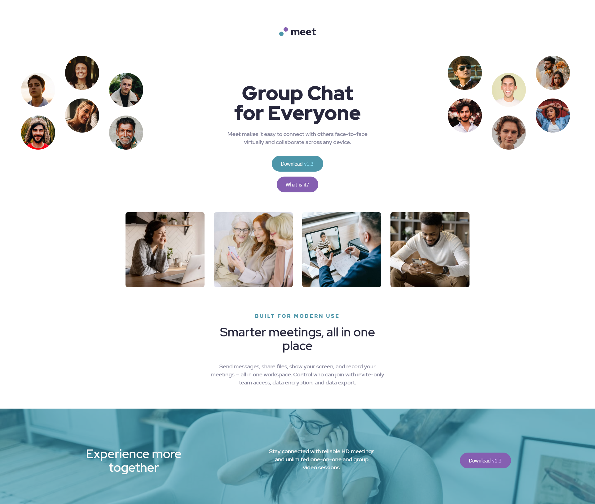
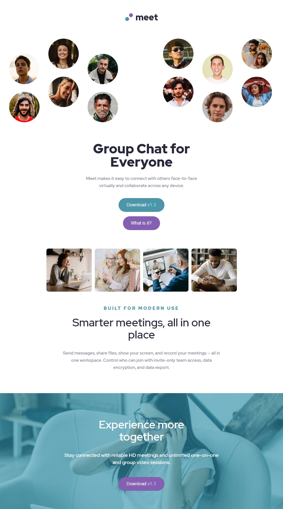

# Frontend Mentor - Meet landing page solution

This is a solution to the [Meet landing page challenge on Frontend Mentor](https://www.frontendmentor.io/challenges/meet-landing-page-rbTDS6OUR). Frontend Mentor challenges help you improve your coding skills by building realistic projects. 

## Table of contents

- [Frontend Mentor - Meet landing page solution](#frontend-mentor---meet-landing-page-solution)
  - [Table of contents](#table-of-contents)
  - [Overview](#overview)
    - [The challenge](#the-challenge)
    - [Screenshot](#screenshot)
      - [Desktop](#desktop)
      - [Table](#table)
      - [Mobile](#mobile)
    - [Links](#links)
  - [My process](#my-process)
    - [Built with](#built-with)
    - [What I learned](#what-i-learned)
    - [Continued development](#continued-development)
  - [Author](#author)

**Note: Delete this note and update the table of contents based on what sections you keep.**

## Overview

### The challenge

Users should be able to:

- View the optimal layout depending on their device's screen size
- See hover states for interactive elements

### Screenshot
#### Desktop

#### Table

#### Mobile

### Links

- Solution URL: [Front end mentor solution](https://www.frontendmentor.io/solutions/meet-landing-page-react-sass-app-_FnpLhuLq)
- Live Site URL: [royer-adames-meet-landing-page.vercel.app](https://royer-adames-meet-landing-page.vercel.app/)

## My process

### Built with

- Semantic HTML5 markup
- CSS custom properties
- CSS Grid
- Mobile-first workflow
- [React](https://reactjs.org/) - JS library
- [Sass](https://sass-lang.com/) - For styles

### What I learned

This was a great project to implement what I already know of React, Sass, and Emmet.

### Continued development

I believe that it styles can be simplify by using more flexiable units, and being flexiable withe website not looking like a pixel perfect copy of the design.

## Author

- Website - [Royer Adames](https://www.linkedin.com/in/royer-adames/)
- Frontend Mentor - [@royeradames](https://www.frontendmentor.io/profile/royeradames)

